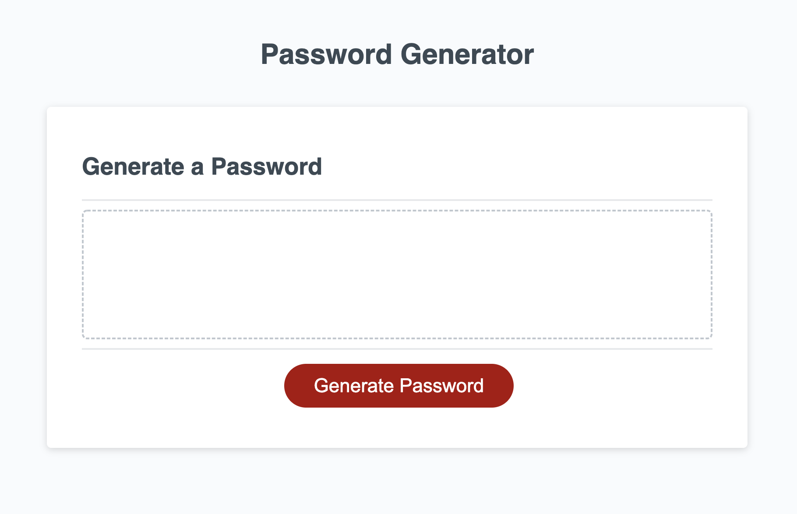
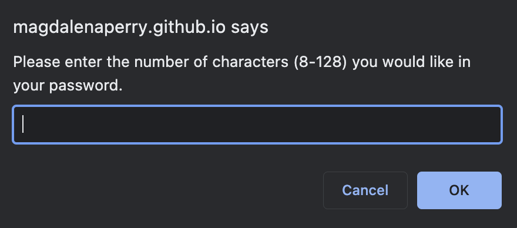
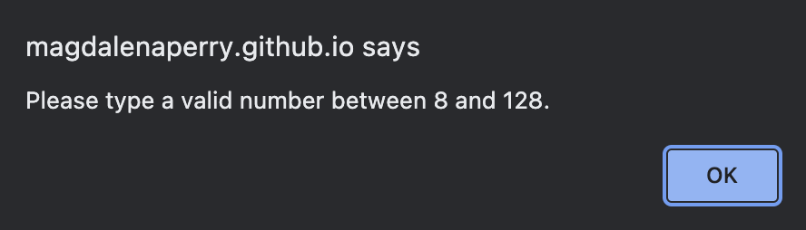
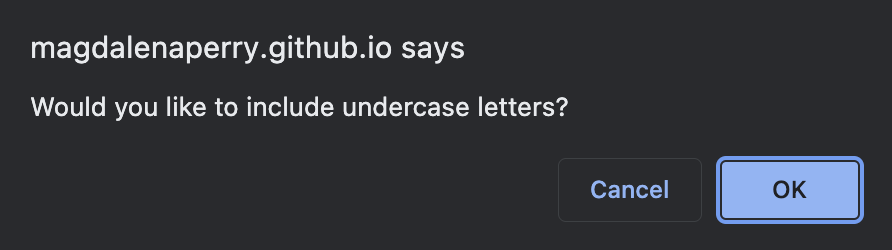
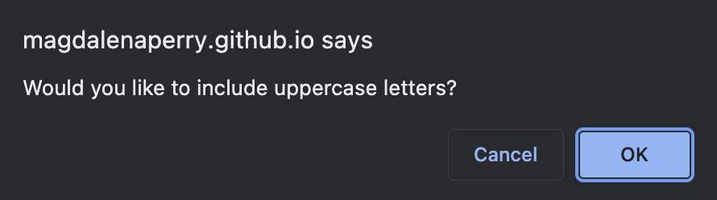
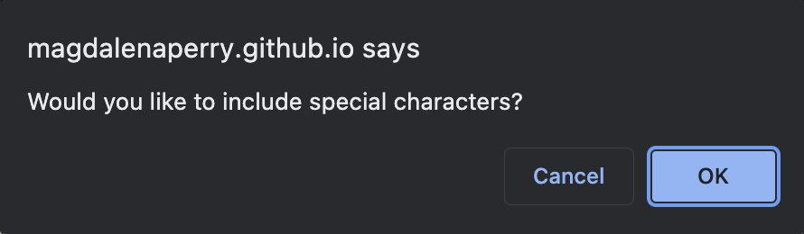
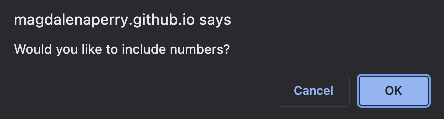
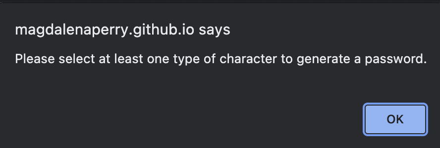

# Password Generator

[Password Generator] (https://magdalenaperry.github.io/pw-generator/)

## Table of Contents
1. [Description](#Description)
2. [Visuals](#Visuals)
3. [Usage](#Usage)
4. [Visuals](#Visuals)

## Description
This is a password generator I created using javascript.

## Usage
When the app is deployed and the user clicks 'generate password', the user is prompted to input the number of characters desired for the password (between 8-128). A series of prompts are then given to ask user if they would like to include lowercase, uppercase, numbers, and special characters in the password. After the user selects the characters they would like, a password is generated in the text area.

## Visuals

#### Password Home

#### Character Number Prompt

#### Input Valid Character Number Alert

#### Undercase Letter Prompt

#### Uppercase Letter Prompt

#### Special Character Prompt

#### Number Character Prompt

#### No Character Selection Alert

